## Introduction

I joined Malt in 2022 as part of the Payment team. For those who don’t know, Malt is a marketplace where clients can
hire freelancers to work on their projects. And when there's work, there's payment—that’s where my team comes in. Once a
client pays and the project is validated, we handle the payouts to the freelancer and take our fee along the way.

Before we can do that, though, there need to be invoices. And invoices mean taxes—especially VAT. On paper, VAT isn’t
rocket science: you apply a rate and calculate the amount. Simple enough, right?

Well, not exactly.

Malt is a fast-growing scale-up, and that means we’re not limited to just one country. Freelancers can sign up from
nearly anywhere in the world (with a few exceptions), and clients can be just as global. And that’s when things get
tricky. In this post, I’ll take you behind the scenes of how we tackled VAT handling across borders—a challenge that
spanned three years to solve due to unexpected real-world constraints.

## A Little Bit Of Context

### How Payments Work at Malt

Before diving into the VAT issue, let’s set the stage with how payments work at Malt. The platform is built to be as
autonomous as possible: clients can post a project, pre-pay it, freelancers can accept, and once the project is
validated by the client, payments are automatically triggered. No manual steps, no back-and-forth—just smooth
automation.

Of course, things don’t always go perfectly. We have a Client Ops team to handle edge cases—most commonly when a client
wires money without using the correct payment reference. In those cases, the transfer can’t be matched automatically and
needs to be manually reviewed and allocated to the correct project. But once the money lands on the right project, the
process picks up from there and continues automatically. Overall, about 80% of client payments are fully automated, and
that number keeps improving as we scale.
See the payments flow through the marketplace as explained above:

At Malt, payments to freelancers aren’t processed in batches. As soon as the money is received and conditions are met,
the payment is triggered automatically. In my previous experiences, payments were usually handled by a critical
scheduled batch—often untouchable and dreaded. It's refreshing to see a more dynamic and reactive system in place.

Clients on Malt pays two invoices: one from the freelancer for the work delivered, and another from Malt for the
platform fees. These invoices can be paid separately, and in practice, the payments don’t always arrive at the same
time.

The next diagram illustrates two scenarios: one where the client pays both invoices together in a single payment, and
another where the freelancer’s invoice is paid first and the platform fees arrive a few days later. (Now, fees can also
arrive before the freelancer payment — we won’t dive into that case here, but feel free to guess what happens. It’s
probably not what you expect 😉)

```mermaid
---
config:
  layout: dagre
---
flowchart TD
    subgraph "Full Payment"
        Client["Client"] -- Pays --> ProjectWallet1["Project 1: 1380€"]
        ProjectWallet1 -- Triggers --> PaymentEngine["Payment Engine"]
        PaymentEngine -- Pays --> Freelancer1["Freelancer: 1140€"]
        PaymentEngine -- Takes Fees --> Platform["Platform: 240€"]
    end

    subgraph "Separate Payments"
        Client2["Client"] -- " Pays (D ) " --> ProjectWallet2["Project 2: 1200€"]
        ProjectWallet2 -- Triggers --> PaymentEngine2["Payment Engine"]
        PaymentEngine2 -- Pays --> Freelancer2["Freelancer: 1140€"]
        PaymentEngine2 -- Takes Fees --> Platform1["Platform: 60€"]
        Client2["Client"] -- " Pays later (D+N ) " --> ProjectWallet3["Project 2: 180€"]
        ProjectWallet3 -- Triggers --> PaymentEngine3["Payment Engine"]
        PaymentEngine3 -- Takes Fees --> Platform1["Platform: 180€"]
    end
```

### Invoicing Models at Malt

When a client and a freelancer agree to work on a project through Malt, the platform handles the full project lifecycle
and payments. But invoicing-wise, things depend on the chosen model.

By default, the invoice is issued directly from the freelancer to the client. This *Direct* model keeps the legal
relationship between them, with Malt simply facilitating the process.

However, Malt is used by a wide range of clients — from small businesses to large enterprises. And for bigger clients
working with pools of freelancers, this model isn’t ideal. They often prefer to deal with just one entity when it comes
to invoicing, reconciliation, and internal processes.

To support that, Malt offers an *Intermediation* model: in this case, the freelancer invoices Malt, and Malt then
invoices the client using its own legal information.

The diagram below illustrates how these two models differ.

```mermaid
---
config:
  layout: dagre
---
flowchart TD
    subgraph "Direct invoicing"
        Freelancer["Freelancer"] -- " Project Invoice (1200€) " --> Client["Client"]
        Malt["Malt"] -- " Fees Invoice (60€) " --> Freelancer
        Malt["Malt"] -- " Fees Invoice (180) " --> Client
    end

    subgraph "Intermediation invoicing"
        Freelancer1["Freelancer"] -- " Project Invoice (1200€) " --> Malt1["Malt"]
        Malt1["Malt"] -- " Project invoice and fees (1380€) " --> Client1
    end
```

### Financing

When working as a freelancer, you're usually paid according to your client's payment terms — often 30 to 90 days after
the project is completed. At Malt, we offer a feature that allows freelancers to get paid just a few days after the
project's completion. We do this by financing the client's invoice through a financing partner. Malt pays the freelancer
upfront, and once the client pays us, we refund the financing partner.

This system benefits freelancers by giving them faster access to their earnings without having to wait for the client's
payment. It also leverages Malt's ability to negotiate better interest rates than freelancers could typically get on
their own.

## When VAT Gets in the Way

The intermediation model helped us onboard big clients, but it also introduced complexity—especially around VAT.

Since the freelancer is invoicing Malt, and Malt is then invoicing the client, different VAT rates can apply to each leg
of the transaction. That means the invoice from Malt to the client might not match the one from the freelancer to Malt.
When all three parties—client, freelancer, and Malt’s billing entity—are based in the same country, the chances of a
mismatch are low. It can still happen, especially with freelancers under a no-VAT regime (0%), but in practice, those
who work with client companies usually start invoicing VAT right away. Since VAT is neutral for those companies, there's
no advantage in staying on a 0% regime, so most professionals move to a VAT-registered status early on.

However, as Malt expanded internationally, this situation became much more common—and much more problematic. Different
countries, different VAT rules, and different freelancer statuses meant we had to start thinking seriously about how to
handle these mismatches.

That difference can create two problematic situations: either we don't collect enough money to pay both the freelancer
and ourselves, or we collect too much and need to handle the surplus.

To make things clearer, let’s break down what happens with actual numbers. Malt takes 5% in fees from the freelancer and
15% in fees from the client, and we assume a 20% VAT rate.

### Case 1: No VAT from Malt to Client

The freelancer invoices Malt for 1200€ (VAT included), with Malt expected to take a 5% fee—so 60€. For the invoice to
the client, Malt works from the VAT-excluded amount, adds its own fee (150€), and applies a 0% VAT rate. This situation
can arise when the client is located in a different country from Malt’s billing entity, requiring different VAT rules.
Since in this case, there’s no VAT added when Malt invoices the client, we can only ask the client for 1150€.

This causes a problem:

- Client pays 1150€
- We owe the freelancer 1200€
- We’re supposed to earn 150€

There’s a shortage: the client didn’t pay enough to cover both the freelancer’s amount and our fees. Something’s wrong.

### Case 2: No VAT from Freelancer to Malt

Now imagine the freelancer sends an invoice for 1000€, without VAT.
Malt adds 15% client-side fee (150€) and 20% VAT on top of the total, invoicing the client 1380€.

So:

- Client pays 1380€
- We pay freelancer 1000€
- We keep 180€ fee

In this case, it’s not a shortage — it’s a surplus. But it’s still messy: the amounts don’t “mirror” between the
freelancer-client relationship and the real cash flow.

This mismatch is the core of the VAT compensation and surplus handling challenge we faced.

## Initial Phase: Handling VAT Mismatches with Minimal Changes

Let’s look at how this VAT mismatch case evolved over time, from early handling strategies to a full product-level
solution three years later. Initially, without any changes to our payment engine, the system would send a
partial payment to the freelancer when there was a shortage due to the missing VAT on the client side. On the other
hand, when there was a surplus—typically because VAT was applied on both sides—the payment engine would assume the
client had overpaid and triggered a refund.

### VAT Surplus: Early Handling via Fees Collection

When the intermediation model was first introduced, the issue of VAT mismatches was quickly identified. The most common
case—when there was a VAT surplus—was handled early on. The Payment Engine was updated to collect this surplus in a
separate step called taxes collection, executed just after fees collection. The funds were routed to a dedicated taxes
wallet, which at the time only existed for Spain, where the intermediation model had first been rolled out.

However, when the model expanded to France, we hit a snag: there was no dedicated taxes wallet. To avoid managing
multiple country-specific wallets and to keep the implementation lightweight, a pragmatic decision have been
made—collect the VAT surplus along with the fees outside of France.

```mermaid
sequenceDiagram
    participant Freelancer
    participant Malt
    participant Client
    participant ProjectWallet
    participant Platform
    Freelancer ->> Malt: Invoices €1000 (VAT = 0%, fees = €50)
    Malt ->> Client: Invoices €1380 (VAT = 20%, fees = €180)
    Client ->> ProjectWallet: Pays €1380 (VAT = 20%)
    ProjectWallet ->> Freelancer: Partial payment €950
    ProjectWallet ->> Platform: Fees collection: €50 + €180 + €200 = €430
```

Taken out of context, this might look like a dirty hack. But in reality, it was a reasonable solution for the time. At
scale, it’s important to make progress, even if it means accepting a few tradeoffs. The volume of edge cases didn’t
justify a fully engineered solution yet. To borrow the mindset of scale-ups like Alan: “Let small fires burn so we can
get to the next project. If the mess starts slowing us down, we’ll fix it.”

#### Drawback: Integrity Mismatches and Confusion

This early solution worked well initially, but once VAT surplus began being collected alongside fees, discrepancies
started to surface. The system was logging integrity errors, flagging that too much had been collected in fees. This
made sense from a data consistency perspective—the accounting system expected only actual fees, not a mix of fees and
VAT surplus.

<h4>Admin View: Fee Display Affected by VAT Surplus</h4>

The confusion extended beyond the technical side. Some members of the client operations team, unaware of the VAT surplus
handling logic, began reporting these integrity issues as bugs. The engineering team found themselves repeatedly
clarifying the situation with a now infamous line:
“It’s not a bug, it’s a feature.”

At Malt, revenue is monitored by tracking the amount of fees collected. Including VAT surplus alongside fees sometimes
inflated these numbers. Initially, the impact was minimal, but over time, there were cases where the reported amount of
collected fees jumped by a factor of four—simply due to the VAT surplus being included. Fortunately, our financial
reporting relies on invoice data, which reflects the accurate figures. Still, this mismatch could cause confusion or
surprise, especially when observing a sudden spike in payouts to our bank account.

### VAT Shortage: Partial or Manual Payments

Cases where no VAT was applied on the client side were even rarer. In those situations, freelancers might still receive
the full amount if our fees were enough to cover the difference. If not, our client ops team manually completed the
payment with an extra transfer. They had access to internal integrity checks that would flag when a freelancer hadn’t
been fully paid. Once identified, they would resolve the issue by manually sending the missing amount from a dedicated
“Divers” wallet to complete the freelancer’s payment.

**Manual VAT Compensation by Client Ops:**

```mermaid
sequenceDiagram
    participant Freelancer
    participant Malt
    participant Client
    participant ProjectWallet
    participant ClientOps
    Freelancer ->> Malt: Invoices €1200 (VAT = 20%, fees = €60)
    Malt ->> Client: Invoices €1100 (VAT = 0%, fees = €100)
    Client ->> ProjectWallet: Pays €1100 (VAT = 0%)
    ProjectWallet ->> Freelancer: Partial payment €1100
    ClientOps ->> Freelancer: Pays missing €40 manually
    Note left of ClientOps: Money taken from specific wallet
    ClientOps ->> ProjectWallet: Registers €40 paid to freelancer
```

**VAT Shortage Covered via Client Fees:**

```mermaid
sequenceDiagram
    participant Freelancer
    participant Malt
    participant Client
    participant ProjectWallet
    Freelancer ->> Malt: Invoices €1200 (VAT = 20%, fees = €60)
    Malt ->> Client: Invoices €1150 (VAT = 0%, fees = €150)
    Client ->> ProjectWallet: Pays €1150 (VAT = 0%)
    ProjectWallet ->> Freelancer: Freelancer Payment €1140
```

#### Drawback: Manual Handling and Hidden Inconsistencies in VAT Shortage Cases

While manual handling is a clear drawback, it’s manageable when the number of cases is low—as long as the process is
well-documented and users are properly onboarded. However, relying on memory or expecting perfect execution isn’t
realistic. Over time, partial payments were disabled because freelancers didn’t understand why they were receiving only
part of their money. This meant client ops had to manually trigger the partial payment and then complete it with an
additional transfer. Some were unaware of this two-step process and instead took the funds directly from the wallet
associated with the project. The Payment Engine’s internal accounting—based on incoming and outgoing flows—wasn’t aware
of this, and still considered the money to be available. This left the project in a broken state, requiring
investigation and manual fixes later on.

## Second Iteration: Addressing Manual Payments and VAT Shortages

Fast-forward to 2023, after I had been working on the Payment team for more than six months. By then, a new team had
been created to handle invoicing more deeply. As they started exploring this area, they uncovered these VAT mismatch
cases happening more frequently—still manageable, but growing. It was the first time I really heard about the problem.

One major discovery was around completing freelancer payments when there was a VAT shortage. Since the payment process
was fully automated, any manual intervention risked leaving the project wallet and payment engine out of sync. Consider
this example:

- Freelancer invoices €1,200 (VAT included).
- Our fees on the freelancer side are €120.
- The client pays only €1,000 because no VAT applies on their side.

In this situation, the project wallet holds the €1,000, but the freelancer is owed €1,080 (their invoice minus fees),
leaving an €80 gap.

If a client ops manually completes the missing €80 and pays the full €1,080 to the freelancer, the project wallet does
not record that manual €80 addition. Later, when the client pays the €150 fees, the payment engine is unaware of the
manual top-up and risks sending €80 again to the freelancer.

Because split payments like this can occur, even if they are edge cases, the need for a new process became clear.

Thankfully, there was already a feature allowing client ops to register manual freelancer payments on the project. This
registration helps the payment engine know when freelancers have been fully paid, avoiding accidental overpayments.

My first task on this was gathering data on these manual payments done by client ops to understand their frequency and
impact. This was crucial to prioritize developing a robust product-level solution.

### Drawback: “Sleeping Money” Due to Registered Manual Payments

Registering manual freelancer payments on the project helped avoid accidental overpayments. However, it introduced a
significant side effect in the payment engine’s balance tracking.

Let’s revisit the example:

- Freelancer invoices €1,200 (VAT included).
- Our fees on the freelancer side are €60.
- The client first pays €1,000 (no VAT on their side).
- A client ops manually complete the freelancer payment by sending €140.
- That manual €140 payment is registered on the project as completed.

The €140 used to complete the payment is taken from somewhere outside the project wallet.

But the payment engine’s internal accounting sees:

- +€1,000 (client payment)
- -€1,000 (freelancer payment)'
- -€140 (registered manual freelancer payment)

Adding up to -€140 — meaning the engine thinks the project wallet is missing €140.

Then, when the client later pays the €150 fees, the engine’s balance is now +€10, so it won’t collect the
fees or release the money, leaving funds blocked on the project wallet. This trapped cash is what the team calls
“sleeping money.”

The impact of sleeping money became even more critical when considering financing.

Let’s extend our previous scenario to include financing:

- Freelancer invoices €1,200, with €60 in fees on their side.
- Malt invoices the client for €1,100, assuming €100 of fees on the client side.
- The client invoice is financed, and Malt receives €1,100 upfront from the financing partner.
- To pay the freelancer, we need €1,140 (€1,200 - €60), but we're €40 short.
- A client ops manually adds €40 and registers it on the project to complete the freelancer payment.

From the payment engine’s perspective, this creates a -€40 balance on the project wallet.

Later, the client pays the €1,150 invoice. The engine now sees:

- +€1,100 (financing)
- -€1,100 (freelancer payment)
- -€40 (manual freelancer payment)
- +€1,100 (client payment)

Total internal balance = €1,060 actual vs €1,100 expected, leaving a -€40 imbalance. Despite the money being there, the
engine won’t release it to repay the financing partner because its internal accounting thinks there’s still a shortage.

Now the full €1,150 stays locked — a much larger sleeping money scenario.

And in reality, freelancers often invoice much more than €1,200, so the sleeping money tied up in such cases can be far
more significant, leading to major reconciliation issues and distorted cash flow visibility.

The money remains blocked, and in the meantime, we continue paying fees to our financing partner for months — despite
already having the funds on our side. Eventually, the financing partner may even ask us to refund the full financed
amount. That refund is done from a separate treasury account, not the project wallet. As a result, the original money
sitting in the project wallet continues to sleep indefinitely, no longer useful and detached from its intended flow.

## A Turning Point: Prioritizing a Product Solution

During 2023, the Payment team had the opportunity to fully focus on core payment logic, as invoicing and project
lifecycle were handled by other dedicated teams. This allowed for significant structural improvements.

One major initiative was reducing dependency on our PSP (Payment Service Provider). All payment transfers were routed
through a dedicated app that abstracted away the logic tied to the PSP. The Payment Engine would simply issue a command
like "pay the freelancer," and the app would take care of the execution. This architecture made switching PSPs easier
and also allowed us to create dedicated wallets for specific purposes, such as VAT surplus and compensation.

We also undertook a full refactor of the Payment Engine. Previously, a complex web of conditions determined the
actions (e.g., paying freelancers, collecting fees). After the refactor, these became modular steps. This made the
codebase more readable and maintainable—and most importantly—allowed us to easily introduce new steps like VAT surplus
collection or VAT shortage compensation.

Another critical improvement was syncing wallet balances from the PSP on our side. This gave us visibility into "
sleeping money"—funds stuck in wallets long after clients had paid. We started triggering integrity alerts when a
project wallet remained non-empty months after the invoice was settled.

Meanwhile, data gathered from manual transfers by Client Ops showed the scale of the issue: around 150 cases per month
were being handled manually, not even counting cases where VAT shortages were silently covered by our fees. On the
accounting side, external tools were unaware of VAT being bundled into fees, leading to mismatches and reconciliation
difficulties.

With these findings and infrastructure improvements, the subject could no longer be deferred—it had become a product
priority. A real solution was now necessary.

### Implementing the Solution

As my teammates were busy with large refactoring efforts, I took the lead on implementing the long-awaited solution to
handle VAT compensation and surplus refund cases cleanly and automatically.

### A New Step in the Payment Engine

The core design was straightforward: we needed to introduce a new step in the Payment Engine that would determine
whether a compensation or surplus refund transfer should be initiated. The transfer would be made from a dedicated
compensation wallet. Fortunately, by that time we had already laid the groundwork to support multiple wallets—each
billing entity had its own compensation wallet, and each wallet was currency-specific.

**Solution Flow: Surplus Refund Collected from Dedicated Wallet**

```mermaid
sequenceDiagram
    participant Client
    participant ProjectWallet
    participant PaymentEngine
    participant Freelancer
    participant CompensationWallet
    participant FeesWallet
    Client ->> ProjectWallet: Pays €1380 (VAT = 20%)
    PaymentEngine ->> PaymentEngine: Should trigger VAT compensation? No
    PaymentEngine ->> ProjectWallet: Trigger freelancer payment
    ProjectWallet ->> Freelancer: Pay Freelancer (€950€)
    PaymentEngine ->> ProjectWallet: Trigger fees collection
    ProjectWallet ->> FeesWallet: Collect Freelancer fees (€50)
    PaymentEngine ->> PaymentEngine: Should trigger VAT surplus refund? Yes
    PaymentEngine ->> ProjectWallet: Trigger VAT surplus refund
    ProjectWallet ->> CompensationWallet: Collect VAT surplus (€200)
    ProjectWallet ->> FeesWallet: Collect client fees (€180)
    note over ProjectWallet: Balance = 0
    note over PaymentEngine: Balance = 0
```

**Solution Flow: Manual VAT Compensation via Dedicated Wallet**

```mermaid
sequenceDiagram
    participant Client
    participant ProjectWallet
    participant PaymentEngine
    participant Freelancer
    participant CompensationWallet
    participant FeesWallet
    Client ->> ProjectWallet: Pays €1150 (VAT = 0%)
    PaymentEngine ->> PaymentEngine: Should trigger VAT compensation? Yes
    PaymentEngine ->> ProjectWallet: Trigger VAT compensation
    CompensationWallet ->> ProjectWallet: VAT compensation (€200)
    PaymentEngine ->> ProjectWallet: Trigger freelancer payment
    ProjectWallet ->> Freelancer: Pay Freelancer (€1140€)
    PaymentEngine ->> ProjectWallet: Trigger fees collection
    ProjectWallet ->> FeesWallet: Collect Freelancer fees (€60)
    PaymentEngine ->> PaymentEngine: Should trigger VAT surplus refund? No
    ProjectWallet ->> FeesWallet: Collect client fees (€150)
    note over ProjectWallet: Balance = 0
    note over PaymentEngine: Balance = 0
```

We also had alerting in place to notify us when a compensation wallet needed replenishment. In practice, because both
compensation and refund flows used the same wallet, the balance often remained stable enough to avoid frequent top-ups.

### Feature Flag & Legacy Behavior

The new logic was feature-flagged, which introduced its own challenges. The flag had to propagate across multiple
layers—down to service classes and entity models that computed amounts for fees and taxes. For example, when the feature
was disabled, methods returning fee amounts had to maintain their original behavior. This required careful handling to
ensure backward compatibility.

Even with a feature flag in place, rigorous testing—via both unit tests and QA—was essential. Most payments for affected
projects arrive in batches from our PSP, and if something goes wrong, we might not have enough time to identify the
issue and disable the feature flag before further transactions are processed.

Moreover, our payment flow can be triggered at any time—even for very old projects. We’ve seen cases where payments were
made for projects completed over a decade ago. The code needed to handle these scenarios gracefully. For instance,
surplus refunds should not be triggered for projects where the VAT surplus was already collected in the fees. Also,
these projects should not raise integrity check alerts for missing VAT surplus collection.

### Handling Legacy Projects

One significant challenge we faced was addressing the backlog of older projects impacted by these issues. At Malt, the
Integrity Batch system performs automated checks to ensure project consistency. Two new checks were introduced
specifically to detect:

1. Missing compensation transactions.
2. Missing surplus refund transactions.

These checks identified approximately 500 affected projects.

For many, Client Operations (Client Ops) had already intervened manually, and we only needed to register the missing
transactions to allow the Payment Engine to reconcile properly. However, for projects where no surplus refund was
recorded, additional logic was implemented to analyze associated tax and fee transactions:

- **If the VAT surplus was included in the tax or fee transactions,** the project was deemed consistent and no further
  action was required.
- **Breaking down improper transactions into their proper components** would have been ideal. However, this was already
  being addressed by a separate ongoing project.

To efficiently handle older projects that had "blocked" funds, we implemented a new automation—**CompensationFixer.**
This batch job was specifically designed to restore consistency within the Payment Engine without requiring manual
intervention.

To illustrate, here’s the automated flow for a typical scenario where a manual transaction caused an imbalance:

```mermaid
sequenceDiagram
    participant ProjectWallet
    participant PaymentEngine
    participant CompensationFixer
    participant CompensationWallet
    participant FinancingPartner
    participant FeesWallet
    note over ProjectWallet: Manual transaction = €40<br>Balance = €1100
    note over PaymentEngine: Balance = €1060
    CompensationFixer ->> CompensationFixer: Should fix project? Yes
    FixerBatch ->> ProjectWallet: Register compensation transaction (€40)
    note over PaymentEngine: Balance = €1100
    PaymentEngine ->> PaymentEngine: Trigger payment flow
    PaymentEngine ->> ProjectWallet: Trigger VAT compensation
    CompensationWallet ->> ProjectWallet: VAT compensation (€160)
    PaymentEngine ->> ProjectWallet: Trigger financing refund
    ProjectWallet ->> Freelancer: Refund financing partner (€1100€)
    PaymentEngine ->> ProjectWallet: Trigger fees collection
    ProjectWallet ->> FeesWallet: Collect Freelancer fees (€60)
    PaymentEngine ->> PaymentEngine: Should trigger VAT surplus refund? No
    ProjectWallet ->> FeesWallet: Collect client fees (€100)
    note over ProjectWallet: Balance = 0
    note over PaymentEngine: Balance = 0
```

The CompensationFixer batch checks the integrity of old projects and adds missing compensation transactions where
needed. Once the balance is corrected, the normal payment flow is triggered automatically, unblocking downstream actions
like:

- Refunding the financing partner
- Collecting freelancer and client fees
- Preventing false positives in VAT surplus integrity checks

This approach helped recover large amounts of sleeping money—bringing long-blocked projects back to life.

### Enabling the Feature and Post-Deployment Lessons

Once the implementation was complete, we couldn’t enable the feature immediately. We had to wait for the green light
from the accounting team, as it required alignment with the workflows of an external financial tool they were using.
Only once this coordination was in place could we activate the batch job to fix impacted projects and unlock the new
logic.

#### Post-Deployment Observations

After the batch ran successfully, we uncovered a few edge cases—mostly involving old projects—that needed attention:

* **Incorrect VAT Classification in Old Projects:**
  Some old projects were returning amounts without VAT, while in reality, VAT was present but mislabeled as "Other."
  This had been caused by an old bug that had already been fixed—but no one had cleaned up existing affected data. This
  led to incorrect triggering of the surplus refund and compensation steps. We introduced a workaround that compares
  the "Other" tax amount to the expected VAT and treats them as equivalent when they match. To handle minor
  discrepancies (often just one cent), we leveraged our existing `equalsWithAOneCentTolerance` method. Thankfully, only
  a few projects fell into this category.

* **Incorrect Surplus Refunds Due to Intermediation Confusion:**
  Surplus refunds should only be triggered for projects using intermediation. The logic was initially based on
  `isIntermediation` method, but we later discovered we had two types of intermediation—something not widely known. This
  made the check insufficient and led to some incorrect refunds. This surfaced deeper flaws in the payment engine
  implementation.

* **Freelancer VAT Rate Correction After Financing:**
  A recurring issue (a few times per month) involved freelancers mistakenly setting their VAT rate to 0%, only to later
  claim it was 20% after they’d already received their payment via financing. By that point, the surplus refund had
  already been sent to
  the compensation wallet. The fix was to **delay surplus refunds until the client payment**. This way, if the VAT rate
  was updated in the meantime, the surplus could still be redirected to the freelancer. The trade-off was having money
  “sleep” in the project wallet for a few days—acceptable in this context.

* **Missing Compensation Wallets for Some Currencies:**
  Some projects failed to process because the compensation wallet in the project’s currency didn’t exist. For instance,
  the UK billing entity didn’t have a EUR compensation wallet, assuming it would never be needed. But we did have
  euro projects linked to the UK entity. After extensive discussions with accounting, we agreed to **create
  compensation wallets for all supported currencies**. Our product infrastructure already supported multiple wallets per
  billing entity, so the added complexity was minimal.

## Impact of the Feature

This feature brought measurable improvements across multiple teams and processes.

### Reduced Manual Work for Client Operations

One of the 2023 OKRs was to improve operational efficiency. From our internal data, we identified around **150 manual
interventions** related to VAT shortage handling—each requiring non-negligible time from the ClientOps team. While the
time spent on actions was a few hours per month, the **real cost was higher**, considering the overhead from Jira ticket
creation, coordination, and context switching.
With this feature live, **one major pain point has been eliminated**, freeing up ClientOps to focus on higher-value
tasks.

### Better Accounting and Audit Readiness

This feature also **enabled clean, auditable records** for the accounting team. Previously, some transactions (
especially compensation-related ones) weren’t clearly visible or categorizable in their tools. Now, these special
transactions are **fully tracked and labeled**, making them easily exportable and explainable for audits, financial
reports, and tax declarations.

### Recovered and Reallocated Funds

Fixing the logic and reprocessing old impacted projects had a **direct financial benefit**:

* **\~1 million euros** of previously “sleeping” funds were unblocked.
* **\~600k€** were refunded to **financing partners**, allowing us to stop accruing interest on unpaid amounts.
* The rest consisted of **fees and uncollected taxes**, which were properly routed to the correct internal wallets.

These funds not only resolved liabilities but also **improved cash flow visibility** and helped us settle payments on
time for freelancers—critical for maintaining trust and platform reliability.

## What I Learned

This project was special to me because it was the first feature I was solely responsible for at Malt. While the overall
design was a team effort, I was the one to take it from concept to implementation. It was incredibly satisfying to see
the direct impact of this work, especially unblocking such a large amount of sleeping money—over 1 million euros.
That unblocking moment was a highlight, showing how even a focused, single feature can make a significant difference. It
also gave me more confidence as a developer, knowing I could handle an important part of the platform, even for a
challenge that had persisted for years.
This project taught me the value of persistence and the importance of addressing long-standing issues. Wrapping it up
and seeing the outcomes felt like a milestone both for the platform and for my own journey at Malt.
